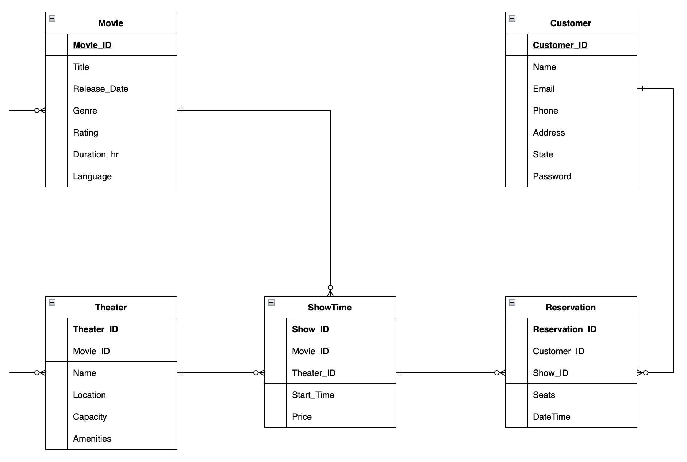

# **Movie-Ticket-Reservation-System**
 
## **Objectives**
 
* Generate Data for the database from online sources
* Use ETL with python to preprocess the data
* Implement the **Arango** database for movie ticket reservation system
* Implement ongoing data refresh using **Python**
* Execute queries to analyze the stored data to get insights
* Create visualizations using **Tableau** to see the trend of the data
 
### **Architecture Diagram**
 

 
### **Document Diagram**
 

 
### **Graph Diagram**
 
