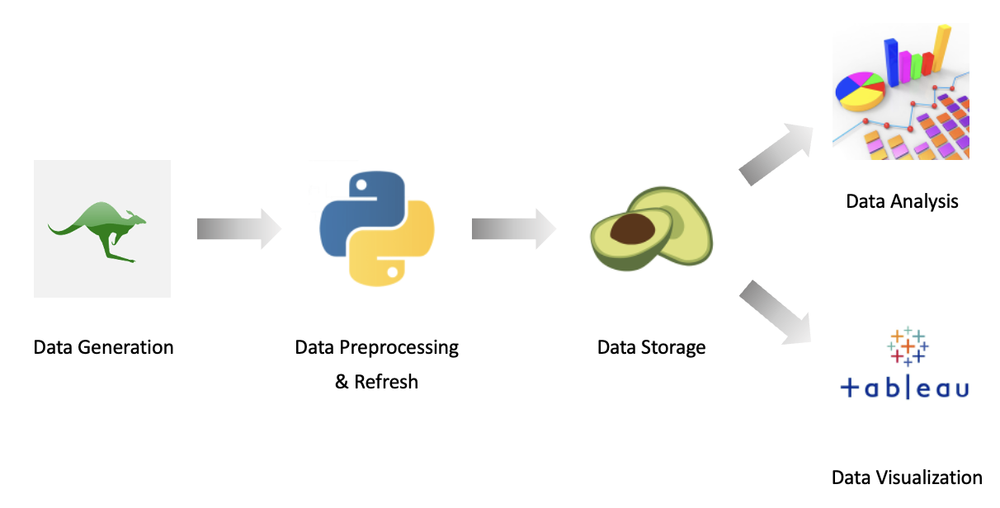
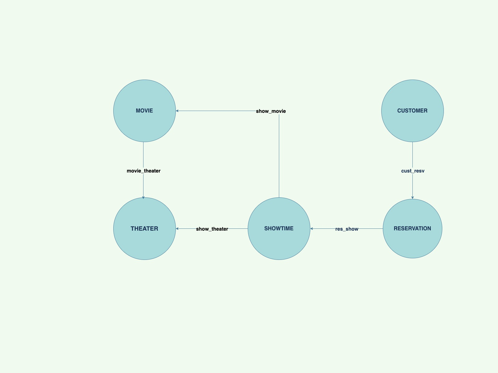

# **About the Project**

 

* The project aims to build a database system for movie ticket reservation using the ArangoDB document data model.
* The database has 5 collections: Customer, Reservation, Showtime, Movie and Theater.
* The project focuses on analyzing the data in the system to discover trends and insights about customers, movies, and theaters.
* The analysis is done using complex ArangoDB queries and visualizations created using Tableau.
* The goal is to use these insights to increase the potential revenue for entities involved in the movie theater business.

 

## **Objectives**

 

* Generate Data for the database from online sources
* Use ETL with python to preprocess the data
* Implement the **Arango** database for movie ticket reservation system
* Implement ongoing data refresh using **Python**
* Execute queries to analyze the stored data to get insights
* Create visualizations using **Tableau** to see the trend of the data

 

## **Architecture Diagram**

 

 

## **Document Diagram**

 

 

## **Graph Diagram**

 

